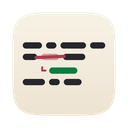
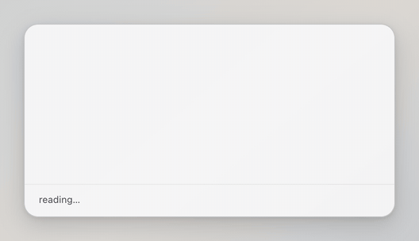

<h1 align="center">
  
  <br>
  redpen
</h1>

<p align="center">
  A macOS menu-bar app that <strong>critiques</strong> your English instead of correcting it.
</p>

<p align="center">
  
</p>

Select text anywhere, press <kbd>⌥⌘E</kbd>, and a small card tells you what sounds off and
why. It never inserts, replaces, or pastes anything — you retype the fix yourself.

That is the whole point. A tool that rewrites your text for you teaches you nothing: you
copy the clean version, ship it, and make the same mistake next week. redpen shows you the
*mechanism* — "Russian *зависеть от* carries the *from* across; English `depend` takes
`on`" — because a rule you understand is one you carry into the next message.

What it flags is **foreignness**. "I have a possibility to join tomorrow" breaks no grammar
rule and is instantly non-native; that gap is the product. A spellchecker already caught
everything else.

## Install

Download the latest `.dmg` from [**Releases**](https://github.com/pronskiy/redpen/releases/latest)
and drag redpen to Applications.

Builds are not notarized yet, so macOS blocks the first launch. Right-click the app →
**Open** → **Open**, or clear the quarantine flag yourself:

```sh
xattr -dr com.apple.quarantine /Applications/redpen.app
```

redpen lives in the menu bar. There is no Dock icon and no window — look for the mark in
the status bar.

### Two things it needs before it works

**An Anthropic API key.** On first launch redpen writes
`~/Library/Application Support/redpen/config.json` (mode 600) and tells you where it is.
Put your key in the `api_key` field.

**Accessibility permission.** redpen copies your selection by pressing ⌘C for you, and
macOS only allows that with Accessibility permission. The app asks on first launch and
gives you a button that opens the right settings pane.

## Using it

| | |
|---|---|
| <kbd>⌥⌘E</kbd> | critique whatever is selected |
| <kbd>Esc</kbd> | dismiss the card and abort the request |

The card never takes keyboard focus, so your cursor stays exactly where it was — you can
read the note and keep typing in the app you were already in.

Your clipboard is put back the way it was afterwards. If a clipboard manager is running,
redpen skips the restore and leaves your history to it.

## Configuring

Everything lives in `~/Library/Application Support/redpen/config.json`, and edits apply
**live** — save the file and the running app picks them up. No restart.

| Field | What it does |
|---|---|
| `api_key` | Your Anthropic API key |
| `model` | Which model critiques the text |
| `effort` | How hard it thinks — `low`, `medium`, `high`, `xhigh`, `max`. Trades speed for depth |
| `hotkey` | Defaults to `Alt+Cmd+E`; rebinds live |
| `font_size` | Base size for the card, in points — everything scales off it |
| `system_prompt_path` | Point this at your own prompt file to change what gets flagged |
| `update_endpoint` | Where update checks look. Empty turns checks off |
| `base_url` | For an API-compatible proxy |

`config.example.jsonc` documents every field with comments. It is **documentation only** —
the live config has to be strict JSON.

## Updates

Menu bar icon → **Check for Updates…**

If your copy is not signed with a Developer ID, the card says so before offering to
install, because replacing the binary makes macOS revoke the Accessibility permission and
capture stops working until you grant it again.

---

# Development

```sh
npm install
npm run tauri dev
```

macOS only. The app is a Tauri shell: Rust for capture, the API call, and the panel;
a small TypeScript webview for the card.

## Layout

```
prompts/critique.md    the system prompt — the actual product
evals/run.sh           prompt × corpus → rating sheet (bash + curl, no Rust)
docs/corpus/           real texts to test the prompt against; gitignored, stays local
src-tauri/             the Rust app
src/, index.html       the webview
```

## Working on the prompt

Prompt quality *is* the product, so it has its own harness that needs no Rust toolchain and
no app — just the same `config.json` the app reads, so a key or a model is set in one place.

```sh
evals/run.sh -n                            # show what it sees, spend nothing
evals/run.sh                               # run the prompt across the corpus
evals/run.sh -e medium -p prompts/v2.md    # sweep effort, try a variant
```

## Tests

```sh
cargo test --manifest-path src-tauri/Cargo.toml    # Rust unit tests
npx tsc --noEmit                                   # typecheck the webview
```

`docs/manual-tests.md` covers what CI cannot reach: real pasteboards, real Accessibility
permission, and real apps to steal a selection from.

## The permission annoyance

macOS ties Accessibility permission to the exact binary, so **every rebuild can reset it**
and the simulated ⌘C stops working silently. When capture mysteriously returns nothing,
re-grant under System Settings → Privacy & Security → Accessibility before debugging
anything else.

## Releasing

CI runs the tests on every push and pull request. Pushing a `v*` tag builds a signed,
universal binary and opens a draft release; the update endpoint stays dark until you
publish it.

Bump the version in `tauri.conf.json`, `package.json` and `Cargo.toml` together — the
release workflow refuses a tag that disagrees with any of them.
